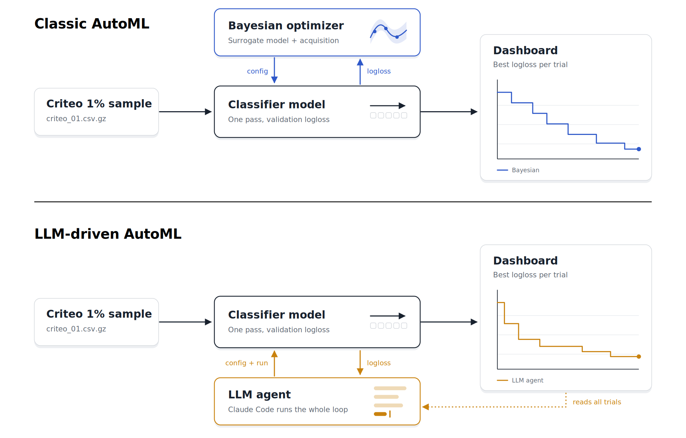

# AutoML 2026 tutorial: From AutoML to AgenticML: LLMs as the New SearchOperator



Hands-on companion for the AutoML 2026 tutorial [*From AutoML to AgenticML:
LLMs as the New SearchOperator*](https://2026.automl.cc/from-automl-to-agenticml-llms-as-the-new-searchoperator/),
which explores LLMs as search operators in AutoML — proposing candidates,
acting as mutation operators, and orchestrating search loops — in place of
classical Bayesian and evolutionary methods. This repo puts that idea into
practice: an LLM acting as the hyperparameter proposer, compared against a
classic Bayesian optimizer, on a single-pass CTR model trained on a 1%
Criteo sample.

## Prerequisites

- [Claude Code](https://claude.com/claude-code) — Examples were tested with Claude Sonnet 5.

## Setup

```bash
uv sync --project config
uv run --project config streamlit run src/dashboard.py
```

Let Claude read the [`AGENTS.md`](AGENTS.md).
The 1% Criteo sample (`data/criteo_01.csv.gz`) already ships in this repo.

## Tasks
Once you setup your environment you can start with the task which live in [`tasks/`](tasks/main.md).

## Source

Dataset: [Criteo Display Advertising Challenge](https://huggingface.co/datasets/Recommenders/criteo)

## Citation

If you use this work, please cite it as:

```bibtex
@misc{automl26_agenticml_tutorial,
  title        = {From {AutoML} to {AgenticML}: {LLMs} as the New Search Operator},
  author       = {Skrlj, Blaz and Koralewski, Sebastian},
  year         = {2026},
  howpublished = {{AutoML} 2026 Tutorial. GitHub repository},
  url          = {https://github.com/seba90/automl26-From-AutoML-to-AgenticML},
  note         = {Accessed: 2026-10-01}
}
```
